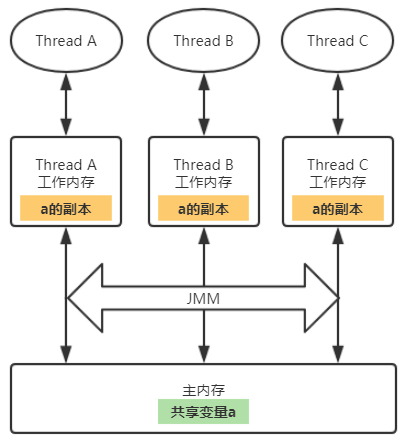
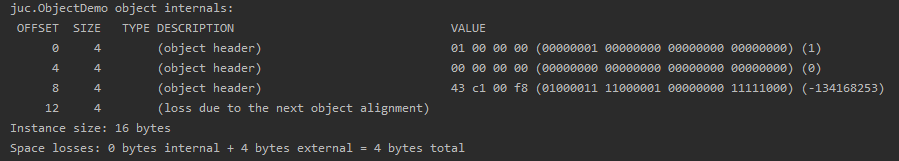
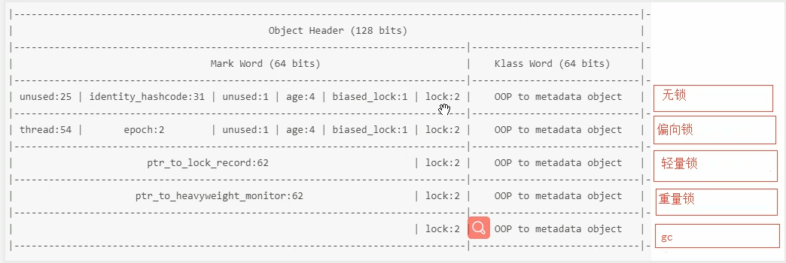
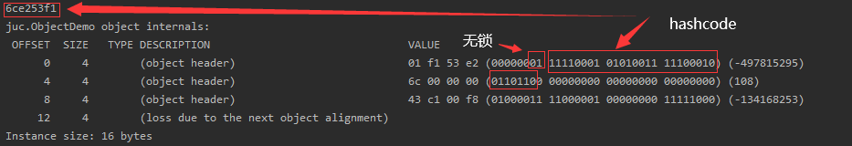
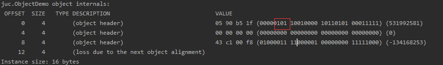
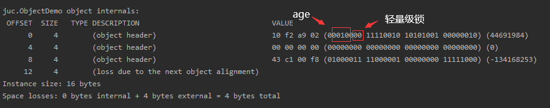
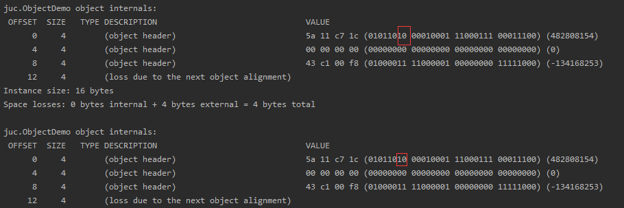

# JUC核心知识点

## 一、JMM



每个线程都有自己的**工作内存**，线程操作数据时，它首先会从主内存中拷贝一份数据到工作内存，操作完毕后再写回主内存。

JMM可能带来**可见性**、**原子性**和**有序性**的问题。

可见性：一个线程对主内存中共享变量的修改对于其他线程来说是可见的，要达到这种效果需要该线程在修改完共享变量后立即通知其他线程。

原子性：是指一个操作是不可分割的。

有序性：是指编译器或操作系统不会对指令进行重排。

## 二、volatile关键字

`volatile`关键字是Java提供的一种**轻量级同步机制**，它能够保证**可见性**和**有序性**，但不能保证**原子性**。

### 可见性

```java
class MyData{
    int number=0;
    //volatile int number=0;

    AtomicInteger atomicInteger=new AtomicInteger();
    public void setTo60(){
        this.number=60;
    }

    //此时number前面已经加了volatile，但是不保证原子性
    public void addPlusPlus(){
        number++;
    }

    public void addAtomic(){
        atomicInteger.getAndIncrement();
    }
}

//volatile可以保证可见性，及时通知其它线程主物理内存的值已被修改
private static void volatileVisibilityDemo() {
    System.out.println("可见性测试");
    MyData myData=new MyData();//资源类
    //启动一个线程操作共享数据
    new Thread(()->{
        System.out.println(Thread.currentThread().getName()+"\t come in");
        try {TimeUnit.SECONDS.sleep(3);myData.setTo60();
        System.out.println(Thread.currentThread().getName()+"\t update number value: "+myData.number);}catch (InterruptedException e){e.printStackTrace();}
    },"AAA").start();
    while (myData.number==0){
     //main线程持有共享数据的拷贝，一直为0
    }
    System.out.println(Thread.currentThread().getName()+"\t mission is over. main get number value: "+myData.number);
}
```

`MyData`类是资源类，一开始number变量没有用volatile修饰，所以程序运行的结果是：

```
可见性测试
AAA	 come in
AAA	 update number value: 60
```

虽然一个线程把number修改成了60，但是main线程持有的仍然是最开始的0，所以一直循环，程序不会结束。

如果对number添加了volatile修饰，运行结果是：

```java
AAA	 come in
AAA	 update number value: 60
main	 mission is over. main get number value: 60
```

可见某个线程对number的修改，会立刻反映到主内存上。

### 原子性

volatile并不能保证操作的原子性，比如i++操作，会形成多条指令：

```assembly
2: getfield      #2                  // Field number:I
5: iconst_1
6: iadd
7: putfield      #2                  // Field numbr:I
```

假设有三个线程同时执行i++，此时若三个线程都拿到i=0，都执行i++操作，则当线程1执行完后，写到主内存中，其他线程执行完i++后也会写回主内存，此时操作结果会被覆盖。

解决方案：

1、对add操作进行加锁！
2、使用java.util.concurrent.AtomicInteger类

### 有序性

volatile可以保证有序性，也就是防止指令重排。所谓指令重排，就是出于优化考虑，CPU执行指令的顺序和程序员自己编写的顺序不一样。

```java
int x = 11; //语句1
int y = 12; //语句2
x = x + y; //语句3
y = x * x; //语句4
```

以上例子中在多线程条件下，12可以互换，34可以互换。但若4在3前，在结果就不对了。

volatile底层是用CPU的内存屏障(Memory Barrier)指令来实现的，有两个作用，一个是保证指令执行的顺序性，二是保证可见性。在指令之间插入一条Memory Barrier指令，告诉编译器和CPU，在Merrory Barrier指令之间的指令不能被重排序。

原理：

volatile写操作，JMM会将本地内存中的共享变量值立即刷新到主内存中。

volatile读，JMM会把该线程本地内存的变量设置为无效，直接从主内存中取。

### 哪些地方用到过volatile?

#### 单例模式

## 三、synchronize关键字

sync上锁：将锁住的对象的对象头状态值改变。



java对象至少有16byte，可以看到对象头占12个字节！

在64位jdk中java对象以8的倍数对齐！

#### java对象：

- 对象头12字节
- 实例数据
- 对齐数据：对齐对象大小为8的倍数

#### java对象头？

64位jdk：java对象头96位！

- Mark Word 64bit
- klass pointer 32bit

对象状态？
1、无状态

2、偏向锁

目的是消除在无竞争情况下的同步原语，进一步提高程序的运行性能。当锁对象第一次被线程获取的时候，虚拟机将会把对象头的标志位设置为“01”，即偏向模式。同时使用CAS操作把获取到这个锁的线程ID记录在对象的Mark Word中，若果CAS成功，那么持有偏向锁的线程以后每次进入这个锁相关的同步块时，虚拟机都可以不再进行任何同步操作！当有另一个线程尝试获取这个锁时，偏向模式就结束了。

3、轻量级锁

本意不是用来代替重量级锁，它本意是在没有多线程竞争前提下，减少传统的重量级锁使用操作系统互斥量产生的性能消耗。

当第一个线程持有锁的时候，会在当前线程的栈帧中创建一个锁记录的空间，用于存储对象目前的Mark Word的拷贝，然后虚拟机将使用CAS操作尝试将Mark Word更新为指向Lock Record的指针，如果更新成功说明该线程持有了该锁对象。

如果更新失败，则看Mark Word是否指向当前线程的栈帧，若是则说明该线程持有该对象的锁，否则说明该对象被其他线程占用了，锁被膨胀为重量级锁。当那个线程释放时，会发现CAS失败，因此会唤醒挂起的线程。

4、重量级锁

5、gc



用javap可以查看编译的字节码，发现在synchronized加锁的代码块和方法的前后有monitorenter和monitorexit指令。

| 存储内容                             | 标志位 | 状态   |
| ------------------------------------ | ------ | ------ |
| 对象hash、分代年龄                   | 01     | 无锁   |
| 偏向线程ID、偏向时间戳、对象分代年龄 | 01     | 偏向锁 |
| 指向锁记录的指针                     | 00     | 轻量锁 |
| 指向重量级锁的指针                   | 10     | 重量锁 |
| 空                                   | 11     | gc     |



在windows中采用

`大端模式：数据的低位保存在内存的高地址中，而数据的高位保存在内存的低地址中，这种存储模式就类似把数据当做字符串顺序处理，例如:数据中两个字节按顺序为：FE 10 ，它表示的一个数就是0xFE10。`

`小端模式：数据的低位保存在内存的低地址中，而数据的高位保存在内存的高地址中，这种存储方式就是将地址的高低和数据的位结合起来，前面的例子按照小端模式表示，应该为：0x10FE。`

偏向锁实例：

偏向锁在Java 6 和 Java 7是默认开启的,但是它在应用程序几秒钟之后才激活,如果有必要可以使用jvm的参数来关闭延迟`-XX:BiasedLockingStartupDelay=0`



加锁后，可以看到变为轻量级锁。





#### synchronized和ReentrantLock区别

- synchronized是JVM层面实现的，而ReentrantLock是API层面
- 两者都是可重入锁
- ReentrantLock增加了一些高级功能
  - 等待可中断 lock.lockInterruptibly()
  - ReentrantLock既可以实现公平锁，也能实现非公平锁
  - ReentrantLock结合Condition可以实现选择性通知

## 三、ThreadLocal

为了实现每个线程专属的本地变量！

```java
public class ThreadLocalDemo {
    private static final ThreadLocal<SimpleDateFormat> formatter = ThreadLocal.withInitial(() -> new SimpleDateFormat("yyyyMMdd HHmm"));

    public static void main(String[] args) throws InterruptedException {
        for (int i = 0; i < 10; i++) {
            Thread.sleep(new Random().nextInt(1000));
            new Thread(()->{
                System.out.println("Thread Name=" + Thread.currentThread().getName() + " default Formatter = " + formatter.get().toPattern());
                try {
                    TimeUnit.MILLISECONDS.sleep(new Random().nextInt(1000));
                } catch (InterruptedException e) {
                    e.printStackTrace();
                }
                formatter.set(new SimpleDateFormat());
                System.out.println("Thread Name=" + Thread.currentThread().getName() + "default Formatter = " + formatter.get().toPattern());
            }, String.valueOf(i)).start();
        }
    }
}
```

Output:

```
Thread Name= 0 default Formatter = yyyyMMdd HHmm
Thread Name= 0 formatter = yy-M-d ah:mm
Thread Name= 1 default Formatter = yyyyMMdd HHmm
Thread Name= 2 default Formatter = yyyyMMdd HHmm
Thread Name= 1 formatter = yy-M-d ah:mm
Thread Name= 3 default Formatter = yyyyMMdd HHmm
Thread Name= 2 formatter = yy-M-d ah:mm
Thread Name= 4 default Formatter = yyyyMMdd HHmm
Thread Name= 3 formatter = yy-M-d ah:mm
Thread Name= 4 formatter = yy-M-d ah:mm
Thread Name= 5 default Formatter = yyyyMMdd HHmm
Thread Name= 5 formatter = yy-M-d ah:mm
Thread Name= 6 default Formatter = yyyyMMdd HHmm
Thread Name= 6 formatter = yy-M-d ah:mm
Thread Name= 7 default Formatter = yyyyMMdd HHmm
Thread Name= 7 formatter = yy-M-d ah:mm
Thread Name= 8 default Formatter = yyyyMMdd HHmm
Thread Name= 9 default Formatter = yyyyMMdd HHmm
Thread Name= 8 formatter = yy-M-d ah:mm
Thread Name= 9 formatter = yy-M-d ah:mm
```

可以看到虽然线程0修改了formatter但是在其他线程中formatter还是原来的值`yyyyMMdd HHmm`。

如果创建了ThreadLocal变量，那么访问这个变量的每一个线程都会有这个变量的本地副本！


## 四、线程池

> 池化技术的主要思想是为了减少每次获取资源带来的消耗，提高资源利用率。创建线程是一个复杂的过程，需要调用操作系统内核的API，然后操作系统要为线程分配一系列的资源，这个成本就高了，所以线程是一个重量级对象，应该避免频繁的创建和销毁。

线程池的优点：

- 降低资源消耗
- 提高响应速度
- 提高线程的可管理性

线程池是一种生产者-消费者模式

Java线程池相关工具类中，最核心的是**ThreadPoolExecutor**，它强调的是Executor而不是一般意义的池化资源。

```java
ThreadPoolExecutor(
  int corePoolSize,
  int maximumPoolSize,
  long keepAliveTime,
  TimeUnit unit,
  BlockingQueue<Runnable> workQueue,
  ThreadFactory threadFactory,
  RejectedExecutionHandler handler) 
```

- corePoolSize：表示线程池保有的最小线程数。有些项目很闲，但是也不能把人都撤了，至少要留 corePoolSize 个人坚守阵地。
- maximumPoolSize：表示线程池创建的最大线程数。当项目很忙时，就需要加人，但是也不能无限制地加，最多就加到 maximumPoolSize 个人。当项目闲下来时，就要撤人了，最多能撤到 corePoolSize 个人。
- keepAliveTime & unit：上面提到项目根据忙闲来增减人员，那在编程世界里，如何定义忙和闲呢？很简单，一个线程如果在一段时间内，都没有执行任务，说明很闲，keepAliveTime 和 unit 就是用来定义这个“一段时间”的参数。也就是说，如果一个线程空闲了keepAliveTime & unit这么久，而且线程池的线程数大于 corePoolSize ，那么这个空闲的线程就要被回收了。
- workQueue：工作队列，和上面示例代码的工作队列同义。
- threadFactory：通过这个参数你可以自定义如何创建线程，例如你可以给线程指定一个有意义的名字。
- handler：通过这个参数你可以自定义任务的拒绝策略。如果线程池中所有的线程都在忙碌，并且工作队列也满了（前提是工作队列是有界队列），那么此时提交任务，线程池就会拒绝接收。至于拒绝的策略，你可以通过 handler 这个参数来指定。ThreadPoolExecutor 已经提供了以下 4 种策略。
  - CallerRunsPolicy：提交任务的线程自己去执行该任务。
  - AbortPolicy：默认的拒绝策略，会 throws RejectedExecutionException。
  - DiscardPolicy：直接丢弃任务，没有任何异常抛出。
  - DiscardOldestPolicy：丢弃最老的任务，其实就是把最早进入工作队列的任务丢弃，然后把新任务加入到工作队列。

## 五、AQS

全称AbstractQueuedSynchronizer，AQS是一个用来构建锁和同步器的框架，使用AQS能简单且高效的构造出应用广泛的大量同步器。如ReentrantLock等。
