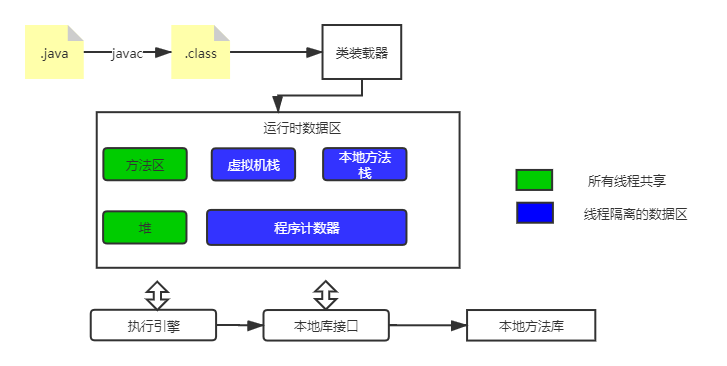
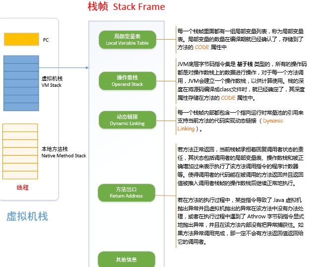
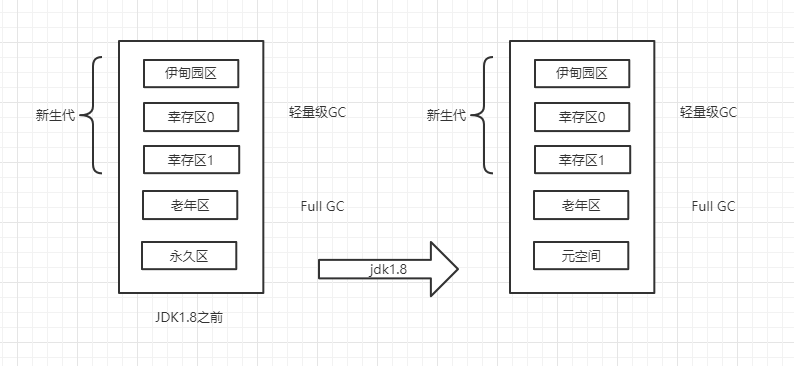
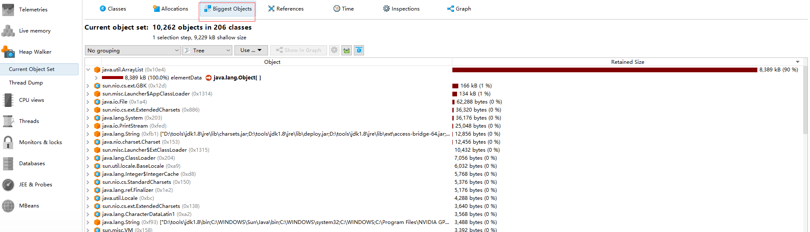
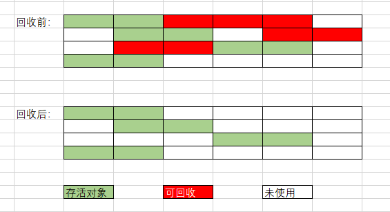
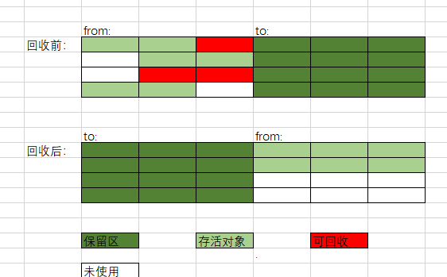
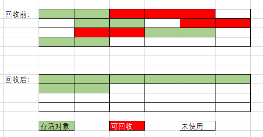

# JVM

## JVM模型图

### 1、程序计数器（Program Counter Register）

每个线程都有一个程序计数器，是线程私有的，用来指向下一条需要执行的字节码指令，分支，循环，跳转和异常处理线程恢复都依赖这个计数器完成。

若执行的是java方法，这个计数器记录的是正在执行的虚拟机字节码地址；若正在执行的是Native方法，这个计数器值为空。

### 2、Java虚拟机栈

用来描述Java方法执行时的内存模型，每个方法在执行时会创建一个栈帧(局部变量表、操作数栈、动态链接、方法出口信息)。

设置Java虚拟机栈大小的方式-Xss1m:表示每个线程栈的大小为1m。

两种异常：

- StackOverFlowError:如果线程请求的栈深度大于虚拟机所允许的最大深度。
- OutOfMemoryError:若虚拟机能够动态扩展时，当虚拟机无法申请到足够内存。

### 3、本地方法栈

功能和Java虚拟机栈相似，不过本地方法栈为使用到的Native方法服务。Sun HotSpot直接将本地方法栈和虚拟机栈合二为一。

### 4、Java堆

 

Java8取消了之前的“永久代”，取而代之的是“元空间”——**Metaspace**，两者本质是一样的。“永久代”使用的是JVM的堆内存，而“元空间”是直接使用的本机物理内存。

通过-Xms和-Xmx控制Java堆初始大小和最大大小。

Heap，一个JVM只有一个堆内存，是所有线程共享的，堆内存的大小是可以调节的。

堆内存中还要细分为三个区域：

- 新生区（伊甸园区）

  - 类：诞生、应用和垃圾回收
  - 所有的对象都是在伊甸园区new出来的

- 老年区

- 永久区

  `这个区域常驻内存，用来存放JDK自身携带的Class对象。Interface元数据，存储的是Java运行时的一些环境或类信息`

  - jdk1.6之前：永久代，常量池在方法区中
  - jdk1.7：永久代，但是慢慢的退化了，去永久代，常量池在堆中。
  - jdk1.8之后：无永久代，常量池在元空间

99%的对象都是临时对象。

GC垃圾回收主要发生在伊甸园区和老年区

假设内存满了，OOM，堆内存不够！java.lang.OutOfMemoryError:Java heap space

在JDK8以后，永久区改名了===》元空间：逻辑上存在物理上不存在，因为新生代和老年代的物理内存相加就等于堆内存

**OOM**

- 1、尝试扩大堆内存
- 2、分析内存，看哪个地方出现问题 

OOM故障排错

- 使用内存快照工具分析出错在第几行，插件排错：MAT、Jprofiler
- 源码Debug

MAT和Jprofiler作用：

- 分析Dump内存文件，快速定位内存泄露
- 获得堆中的数据
- 获得大的对象

**Jprofiler排错**

1.在idea中安装Jprofiler插件，并安装Jprofiler客户端。

2.编一个demo，设置-XX:+HeapDumpOnOutOfMemoryError使得运行时dump出相关错误文件

3.用Jprofiler打开该文件，可以看到哪个对象占用最多的堆内存进行排错。

### 5、方法区

方法区和堆一样，是线程共享的，它用于存放已被虚拟机加载的类信息、常量、静态变量和即时编译器编译后的代码(热点代码会被JIT编译成机器码，从而提高效率)。有个别名Not-Heap，为了和Java堆区分，方法区并不等于永久代，本质两者并不等价，HotSpot团队使用永久代实现方法区，能够省去专门为方法区编写内存管理代码的工作。

- JDK1.7之前：方法区相当于永久代，存放**类信息、常量、静态变量和即时编译器编译后的代码**。
- JDK1.7：仍有永久代，但部分数据迁移到了Java堆和本地内存中，符号引用(如java.util.Scanner)转移到本地内存，字符串常量池转移到Java堆中
- JDK1.8：仍保留方法区的概念，但永久代改成了元空间。
- 垃圾回收目标：常量池的回收(1.6之前)和类型的卸载，但GC的效果不太能令人满意，也会跑出OOM。

#### 回收方发区

GC在方法区回收两部分：废弃常量和无用的类。

### 6、运行时常量池

### 7、直接内存

## 对象的创建

## JVM调优

## 三种JVM

Sun公司：`HotSpot`

BEA:`JRockit`

IBM：`J9 VM`

## GC算法

### **引用计数法**

- JVM一般不采用该方法。
- 会有一个引用计数器记录对象被使用的次数，若计数较少会优先被GC。
- 主流的Java虚拟机没有采用引用计数算法，原因是很难解决对象之间的循环引用问题

### 可达性分析算法

用来判断对象是否存活，从GC Roots对象节点向下遍历形成引用链，若某个对在不再引用链上说明该对象不可达，则该对象可以认为已经死亡。

GC Roots对象包括

- 虚拟机栈中本地方法变量表中的引用的对象
- 方法区中静态变量引用的对象
- 方法区中常量引用的对象(1.8之后在元空间)
- 本地方法栈中JNI引用的对象

### 引用

- 强引用
  - 不可GC，若内存不够就OOM

- 软引用
  - 若内存够则不会被GC，内存不够了再GC，若内存还不够则OOM

- 弱引用
  - 下一次GC一定会被清除

- 虚引用
  - 对对象的GC没有任何影响，作用就是为了跟踪对象的垃圾回收状况。

### **标记清除算法**

最基础的收集算法是“标记-清除”(Mark-Sweep)算法。

同名字，分为两个阶段：

- 标记
  - 标记出需要回收的对象
- 清除
  - 标记完成后，统一回收被标记的对象

说它是最基础的算法，是由于后续算法都是针对它的不足而进行改进的。

缺点：

- 标记和清除的效率这两个过程效率不高
- 会产生内存碎片

### **复制算法**

- 新生代98%的对象都是“朝生夕死”，因此将新生代分为一个Eden和两个Survivor区，比例为8:1。

- 复制算法发生在新生代区域
- 触发轻GC的时候，会触发一次复制算法，将幸存区的from中存活的对象复制到to，此时from变成to，to变成from。
- 如何分辨谁是to？谁空谁是to。

- 可以通过-XX:MaxTenuringThreshold=15设置一个对象进入老年代的时间，经历15次GC还存活的对象进入老年区。当老年区满做一次Full GC时该对象才可能被清除。
- 优点：没有内存碎片
- 缺点：多用一个幸存区空间，在对象存活率较高时，复制算法效率低。
- 复制算法最佳使用场景：对象存活的较低的时候，因此用于新生区。

### 标记-整理算法

第一阶段同标记-清除算法。

第二阶段整理不是清除掉可回收对象，而是让存活对象向一端移动，然后直接清理掉端边界以外的内存。

优点：不用浪费内存，没有内存碎片。

### 分代收集算法

将Java堆分为新生代和老年代：

- 新生代：
  - 由于对象存活率低，采用复制算法

- 老年代：
  - 对象存活率高，因此采用“标记-清除”或“标记-整理”算法。