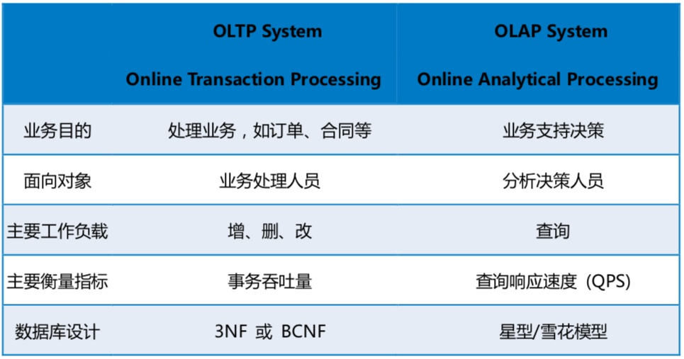
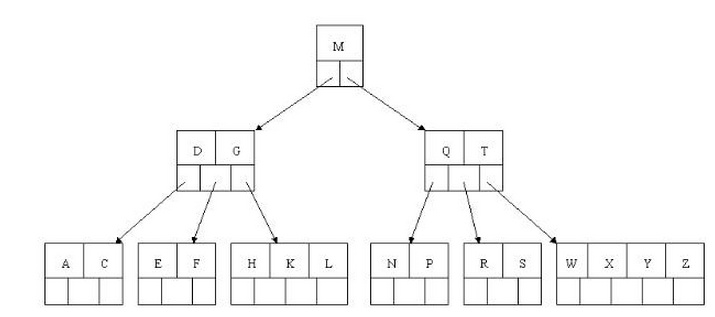
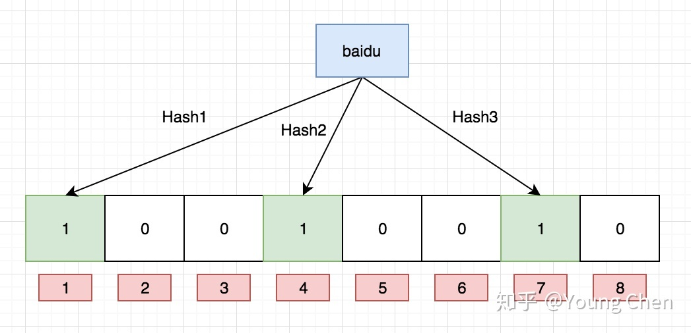

# 数据库相关面试

## 数据库基础

### SQL

#### 基本查询

主义distinct会应用于所有的列出的列。例如：

```sql
select distinct grade, name from student;
```

会根据成绩和姓名组合起来去重，而不是仅根据grade去重。

#### 过滤数据

between操作：

```sql
select prod_name,prod_price from products where prod_price between 5 and 10;
```

检索价格在5到10元之间的所有产品。

#### 空值检索

```sql
select id from customers where email is NULL;
```

#### IN操作

```sql
select name,price from products where id in (1002,1003) order by name;
```

IN操作的优点：

- 更直观且计算次序更容易管理
- IN比OR执行快
- IN里可以包含其他Select语句

#### "%"通配符

%表示任何字符出现任意次数

```sql
select id, name from products where name like 'jet%'
```

#### "_"通配符

下划线只匹配单个字符。

通配符使用技巧，通配符的使用是有代价的：更耗时！若无必要不要使用通配符。

#### 使用正则表达式

```sql
select name from products where name regexp '^[0-9\\.]' order by name;
```

搜索以数字或“.”开头的name

#### 分组数据

##### group by

```sql
select vent_id,count(*) as num_prods from products group by vent_id;
```

一些规定：

- group by子句可以包含任意数目的列
- 除了聚集计算(max,count)外select语句中的每一列都应该在group by 子句中给出
- group by 子句必须出现在where 子句之后，order by之前。

##### having

过滤分组，规定包含哪些分组，排除哪些分组。放在group by之后过滤分组。where在分组之前过滤，having在分组之后过滤

```sql
select cust_id, count(*) as cnt from orders group by cuts_id having count(*)>=2;
```

#### limit

随着数据的增加，页数会越来越多，查看后几页的sql类似于：

```sql
select * from articles where category_id = 123 order by id limit 10000, 10
```

但这样性能很差，可以通过子查询的方式提高分页效率

```sql
select * from articles where id>=(select id from articles where category_id = 123 order by id limit 10000,1) limit 10
```

#### 联结表

join

创建联结：规定要联结的所有表以及它们如何关联即可。

```sql
select vend_name, prod_name, prod_price from vendors, products where vendors.vend_id = products.vend_id order by vend_name, prod_name;
```

vend_name在vendors表中而prod_name,prod_price在products表中。

在一条select语句中联结几个表时，相应的关系是在运行中构造的。where子句的作用是将第一个表中的每一行与第二个表中的行按过滤条件进行匹配，若没有where子句则第一个表与第二个表按每一行进行匹配，最后返回的行数为第一行的行数乘以第二行的行数也就是笛卡尔积。

##### 等值联结(内部联结)

上面的联结称为**等值联结**也叫做**内部联结**

```sql
select vend_name, prod_name, prod_price from vendors INNER JOIN products on vendors.vend_id = products.vend_id;
```

应该优先使用INNER JOIN

##### 自联结

处理自联结比处理子查询快得多。

若有问题商品的id为'DTNTR'，在products表中查找所有该供应商生产的商品

子查询

```sql
select prod_id, prod_name from products where vend_id = (select vend_id from products where prod_id='DTNTR')
```

自联结

```sql
select p1.prod_id, p1.prod_name from products as p1, products as p2 where p1.vend_id=p2.vend_id and p2.prod_id='DTNTR'
```

##### 自然联结

有时候一列可能出现在多个表中，因此需要排除掉。

自然联结排除多次出现的列，使每一列仅出现一次，解决方案是明确指定需要使用的列。

##### 外部联结

left outer join：

选择左边所有的行，对右边进行联结

right outer join:

选择右边所有的行，对左边进行联结

##### left join底层原理

Nested join

- simple nested-loop join
  - 从上往下依次从驱动表中取一个值与非驱动表匹配，时间复杂度为O(nm)
- Index nseted-loop join
  - 要求非驱动表的列上有索引，时间复杂度为O(n*logm)
- block nested-loop
  - 若非驱动表没有索引，将驱动表所涉及的列放到缓存区域，这样操作次数和simple nested-loop join相同，但性能有一定提升。

Hash join

Merge join

#### 组合查询

外键：为某个表中的一列，它包含另一个表的主键值。

若数据存储在多个表中，怎么样用单条select语句检索出数据？

用UNION操作将多条select语句组合成一个结果集。

例如想查询所有价格小于等于5的商品和供应商编号为1001和1002的所有商品，使用UNION操作：

```sql
select vend_id, prod_id, prod_price from products where prod_prices <=5 UNION
select vend_id, prod_id, prod_price from products where vend_id IN (1001,1002);
```

规则：

- UNION必须包含两条以及上SELECT语句
- 包含的列应相同
- 列数据类型必须兼容

UNION会默认去除重复的行，若不想取消则可使用 UNION ALL 

```sql
select vend_id, prod_id, prod_price from products where prod_prices <=5  UNION ALL
select vend_id, prod_id, prod_price from products where vend_id IN (1001,1002);
```

对组合结果排序：

order by只允许加在最后一个select语句中。

### 视图

视图是虚拟的表。

为什么使用视图：

- 重复SQL语句
- 简化复杂的SQL操作
- 使用表的组成而不是整个表
- 保护数据，可以给用户授权访问表的部分数据而不是全部数据
- 更改数据格式和表示

### 存储过程

当需要使用多条语句的使用可以使用存储过程：

简单来说，存储过程就是为以后使用而保存的一条或多条MySQL语句的集合。

**为什么要使用存储过程**

- 通过把处理封装在一个容易使用的单元中，简化操作
- 简化对变动的管理，如果表名或列名发生变化，则只需要更改存储过程的代码
- 由于不需要反复建立一些列处理步骤，这保证了数据完整性

执行存储过程：

```sql
CALL productpricing(@pricelow, @pricehigh, @priceaverage);
```

创建存储过程：

```sql
create procedure productpricing()
begin
	select avg(prod_price) as priceaverage
	from products;
end;
```

删除存储过程：

```sql
drop procedure productpricing;
```

```sql
create procedure productpricing(out pl decimal(8,2), out ph decimal(8,2), out pa decimal(8,2))
begin
	select min(prod_price)
	into pl
	from products;
	select max(prod_price)
	into ph
	from products;
		select avg(prod_price)
	into pa
	from products;
end;
```

调用

```sql
call productpricing(@pricelow, @pricehigh, @priceaverage);
```

查询:

```sql]
select @priceaverage
```

### 游标

MySQL游标只能用于存储过程(和函数)

有时候需要在检索出来的行中前进或后退一行或多行，这时需要使用游标(cursor)。类似于编程语言中的for循环。

### 性能优化


### 索引

### 面试题

#### 1、若名字和关键字冲突

例如 right 在sql中可以写作\`right\`

#### 2、olap，oltp区别

OLTP(online transaction processing)联机事物处理

OLAP(online analytical processing)联机分析处理

OLTP主要对数据进行增删改操作

OLAP主要对数据进行查询操作



#### 3、ACID

是指数据库系统在写入或更新资料的过程中，为保证事物是正确的，所必须具有的四个特性：原子性(atomicity)，一致性(consistency),隔离性(isolation)和持久性(durability)

原子性：一个事物要么全部完成，要么全部不完成。

一致性：事物提交前和完成后，数据库的完整性约束没被破坏。

隔离性：并发执行，分为四个等级，并发能力依次从高到低:未提交读、提交读、可重复读和序列化读。

持久性：事物处理结束后，对数据的修改就是永久的了。

- **READ-UNCOMMITTED(读取未提交)：** 最低的隔离级别，允许读取尚未提交的数据变更，**可能会导致脏读、幻读或不可重复读**。
- **READ-COMMITTED(读取已提交)：** 允许读取并发事务已经提交的数据，**可以阻止脏读，但是幻读或不可重复读仍有可能发生**。
- **REPEATABLE-READ(可重复读)：** 对同一字段的多次读取结果都是一致的，除非数据是被本身事务自己所修改，**可以阻止脏读和不可重复读，但幻读仍有可能发生**。
- **SERIALIZABLE(可串行化)：** 最高的隔离级别，完全服从ACID的隔离级别。所有的事务依次逐个执行，这样事务之间就完全不可能产生干扰，也就是说，**该级别可以防止脏读、不可重复读以及幻读**。

#### 4、索引B树和B+树的区别

##### B树

B树和平衡二叉树稍有不同的是B树属于多叉树又名**平衡多路查找树**；当数据量比较大时，内存中装不下，则需要将数据结构放到磁盘上。

一颗完全M叉树的高度大约为$log_MN$。在二叉查找树中需要一个关键字来决定到底选用哪个分支，在M叉查找树中需要M1个关键字来决定选取哪个分支。



**M阶B树有如下特性：**

- 非叶节点保存指向数据的指针，因此消耗更多的空间。
- 非叶节点数：$M1=[\lceil{M/2}\rceil-1,M-1]$
- 分支数为M1+1。
- 所有叶节点都在相同的深度上。

##### B+树


与B树的区别：

- 非叶节点不保存数据域指针，因此可以消耗空间少
- 非叶节点的中关键字个数同分支数，非叶节点中关键字索引指向子树，且该关键字为子树的最小或最大关键字。
- 叶子节点包含所有的关键字，并且所有叶子节点连成一条链表。

#### 5、关系型数据库和其他数据库的区别是什么？

关系型数据库是指采用关系模型来组织数据的数据库，要求ACID。NoSQL不要求满足ACID。

- 面向高性能并发读写的key-value数据库 Redis
- 面向海量数据访问的面向文档数据库 CouchDB
- 面向可扩展的分布式数据库

#### 6、SQL窗口函数

在日常工作中，经常会遇到在每组内排名，比如下面的业务需求：

> 排名问题：每个部门按业绩排名
>
> topN问题：找出每个部门排名前N的员工进行奖励

面对这类需求就要使用窗口函数了。

窗口函数又称OLAP函数，可以对数据库数据进行实时分析处理。

语法如下

```sql
<窗口函数> over (partition by <用于分组的列名>
               order by <用于排序的列名>)
```

常用窗口函数：

- 专用：rank,dense_rank,row_number
- 聚合函数：max,min,avg,count,sum等

查看班级内的排名

```sql
select * , rank() over (partition by 班级 order by 成绩 desc) as ranking from 班级表；
```

partition by和group by的区别是partition by不会改变原表的行数，而group by会按by把行聚合车一行。

#### 7、MyISAM和InnoDB区别

5.5版本前MyISAM是MySQL默认的数据库引擎，虽然性能极佳，而且提供了大量特性包括全文索引、压缩和空间特性；但不支持事务和行级锁，最大的缺陷是崩溃后无法安全恢复。5.5之后默认引擎为InnoDB。

区别：

- 是否支持行级锁
- 是否支持事务和崩溃后安全恢复
- 是否支持外键
- 是否支持MVCC

#### 8、布隆过滤器

是一种比较巧妙的概率型数据结构，特点是高效地插入和查询，可以告诉你**“某样东西一定不存在或可能存在”**

因此可以用来防止缓存穿透。

布隆过滤器是用多个hash函数生存多个哈希值，并对多个hash值指向bit位置。

