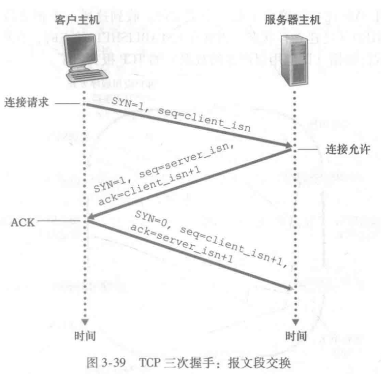
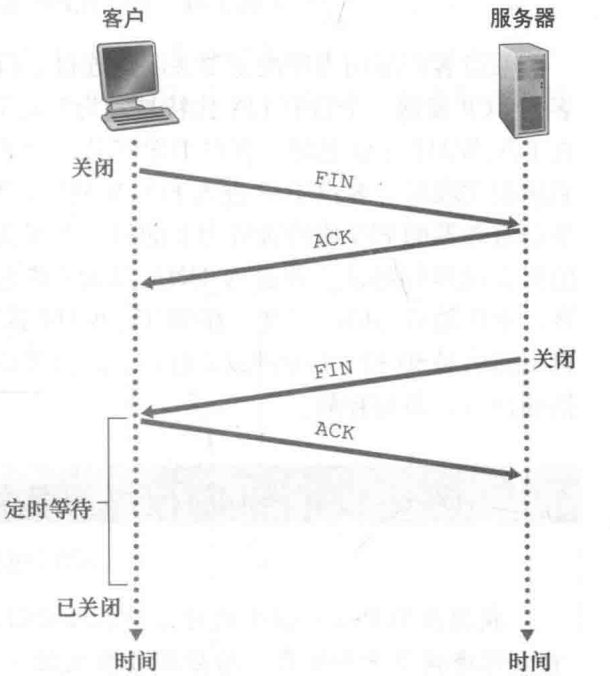
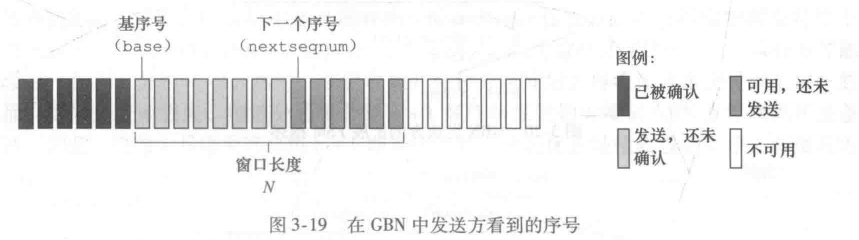
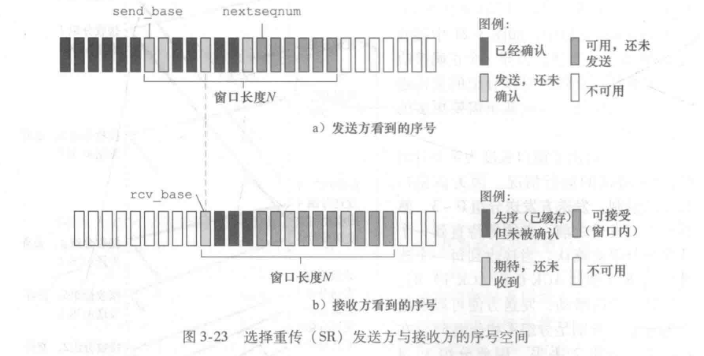

# 计算机网络面试

###  1、OSI和TPC/IP各层的结构与功能，分别有哪些协议？

OSI：物理层、数据链路层、网络层、运输层、会话层、表示层和应用层

TCP/IP：物理层、网络层、运输层和应用层

五层体系结构：物理层、数据链路层、网络层、运输层和应用层

#### 1.1 物理层(比特流)

透明传送比特流：物理层主要实现的是在相邻的计算机之间透明的传送比特流，“透明”是指能够屏蔽掉不同传输介质和物理设备的差异使得数据链路层不必考虑具体传输介质是什么。

#### 1.2 数据链路层(帧)

物理层包括传输介质和传输设备，比特流在物理层传输存在误差，因此引入位于物理层和网络层之间的数据链路层，通过差错检测、差错控制和流量检测能够向网络层提供高质量的数据传输服务。

#### 1.3 网络层(IP数据报)

网络层使用IP协议，在网络中传输数据需要经过很多数据链路，主要任务是在传输时选择合适的路由和交换节点确保数据及时送达。

#### 1.4 运输层

主要使用两种协议：

- TCP：有连接可靠的数据传输协议
- UDP：无连接不可靠，尽最大努力提供数据传输服务

主要任务是向两台主机的进程提供**通用**的数据传输服务。

#### 1.5 应用层(报文)

直接为应用进程提供网络传输服务。

常用协议：

- 域名系统DNS
- HTTP
- 电子邮件SMTP

### 2、TCP三次握手和四次挥手

三次握手是为了让双方知道彼此之间的发送和接收数据的功能都没问题。

#### 2.1 三次握手



1. 第一次握手：客户端---SYN=1, seq=client_isn--->>服务器（SYN=1表示请求连接并随机一个序号，此时服务器能够确认客户端的发送能力OK，自己的接收能力OK）
2. 第二次握手：客户端<<---SYN=1, seq=server_isn, ack=client_isn---服务器 (ack的值为客户端发送的seq+1，表示服务端下次希望从客户端接收到的序号是ack，此时客户端能够确认彼此的发送和接收能力都OK)
3. 第三次握手：客户端---SYN=0, seq=client_isn+1, ack=server_isn+1--->>服务器（该次握手是对服务器接收连接的确认，此时服务器能够确认客户端接受能力OK和自己发送能力OK）

#### 2.2 四次挥手

断开一个连接需要四次挥手：



1. 第一次挥手：客户端---FIN，seq=u--->>服务器（告诉服务器，客户端要不再传输数据）
2. 第二次挥手：客户端<<---ACK, seq=v, ack=u+1---服务器（服务器收到释放连接的报文，此时客户端不再发送数据，但服务器若要发送数据客户端依然要接收）
3. 第三次挥手：客户端<<---FIN, seq=w, ack=u+1---服务器（服务器数据发送完毕，发送释放连接的信号FIN）
4. 第四次挥手：客户端---ACK=1, seq=u+1, ack=w+1--->>服务器（此时服务器直接关闭连接，客户端需要等待2MSL的时间后才进入CLOSED，由于客户端不知道服务器是否接收到ACK，因此为了保证客户端的ACK能够送达服务端需要等待2MSL）

#### SYN洪泛攻击

服务器为了响应一个收到的连接请求，会给其分配初始换连接变量和缓存，然后服务器会发送一个SYNACK响应，若客户端长时间没有响应则服务器会断开半连接并挥手资源。DOS攻击就是攻击方发送大量的SYN请求而不完成第三次握手，服务器的连接资源被耗尽而无法正常服务。

防御方法：

SYN cookie

服务端由一个hash生成seq并不分配资源seq=hash(source_ip,source_port,dest_ip,dest_port)，若客户端响应ACK=hash(source_ip,source_port,dest_ip,dest_port)+1，服务器验证通过后生成一个具有套接字的全开链接，否则不分配资源。

#### 大量TIME_WAIT解决方法

>* a、修改TIME_WAIT连接状态的上限值
>
>* b、启动快速回收机制
>*  c、开启复用机制 
>* d、修改短连接为长连接方式

### 3、TCP和UDP协议的区别

| 类型 | 特点                         | 性能                   | 应用场景                                     | 首部字节 |
| ---- | ---------------------------- | ---------------------- | -------------------------------------------- | -------- |
| TCP  | 面向连接 可靠 用字节流传输   | 传输效率慢、所需资源多 | 要求通信数据可靠（文件传输、邮件、远程登录） | 20-60    |
| UDP  | 无连接 不可靠 用数据报文传输 | 传输效率快、所需资源少 | 要求通信效率高（域名转换、QQ、视频直播）     | 8字节    |

### 4、TCP协议如何保证可靠传输

#### 4.1 ARQ协议

自动重传请求(Automatic Repeat-reQuest, ARQ)，是OSI模型中数据链路层和传输层错误纠正协议之一。通过确认和超时两个机制，在不可靠的传输协议之上实现了可靠的信息传输。如果发送方在一定时间内没有收到确认，则发送发会重传该包。ARQ协议分为停止等待ARQ协议和连续ARQ协议。

- 停止等待ARQ协议
  - 每发送一个数据包，都会停止等待接收方发过来的确认，收到确认后再发送下一个包；若超时则重新发送，接收方重复收到数据包则丢弃，并再发送一个确认。

- 连续ARQ协议(GBN)
  - 允许发送方发送多个分组而不需要等待确认，如下图所示，发送方一次最多能发送N个数据包，只有一个计时器，当发送发接收到确认时会重新计时，接收采用累积确认的方式，若中途丢失了几个包，接收方会返回最后一个确认的序号+1。



#### 4.2 选择重传（SR）

发送发维持N个计时器，同时接收方也维持一个大小为N的窗口，相比于GBN的优点是发送发不用再重复发送已经发送大接收方的包了，缺点是更浪费资源。



#### 4.3 拥塞控制

为了进行拥塞控制，TCP发送方会维持一个拥塞窗口(cwnd)，发送方发送窗口大小为Min(cwnd, 接收方窗口大小)

拥塞控制采用四种算法：

- **慢开始：**开始时拥塞窗口比较小，一般cwnd=1，没经过一个传播轮次后加倍。
- **拥塞避免**：让cwnd缓慢增大，每经过一个RTT就把发送方的cwnd+1
- **快重传和快恢复：**（fast retransmit and recovery, FRR），FRR保证在丢失包时能够快速的让发送方发包，如果接收机收到一个不按顺序的数据段，它会立即给发送方发送一个重复确认。

#### 5、在浏览器输入url->现实主页的过程


### 6、长连接和短连接

HTTP/1.0默认使用短连接，客户端和服务端每进行一次HTTP操作都会建立一次连接。

从HTTP/1.1起，默认使用长连接。使用长连接的HTTP协议会在响应头加如这行：

```html
Connection:keep-alive
```

### 7、HTTP2.0

1、单一长连接

在HTTP/2中，客户端向某个域名的服务器请求页面的过程中，只会创建一条TCP连接，即使这页面可能包含上百个资源。  单一的连接应该是HTTP2的主要优势，单一的连接能减少TCP握手带来的时延 。HTTP2中用一条单一的长连接，避免了创建多个TCP连接带来的网络开销，提高了吞吐量。

2、多路复用

HTTP2虽然只有一条TCP连接，但是在逻辑上分成了很多stream。 

HTTP2把要传输的信息分割成一个个二进制帧，首部信息会被封装到HEADER Frame，相应的request body就放到DATA Frame,一个帧你可以看成路上的一辆车,只要给这些车编号，让1号车都走1号门出，2号车都走2号门出，就把不同的http请求或者响应区分开来了。但是，这里要求同一个请求或者响应的帧必须是有有序的，要保证FIFO的，但是不同的请求或者响应帧可以互相穿插。这就是HTTP2的多路复用，是不是充分利用了网络带宽，是不是提高了并发度？

3、压缩header减少报文大小。

http1.x头部占用太多空间。

4、服务端推送Server Push

服务端能够主动把客户端可能需要的资源推送给客户端。例如服务端主动给客户端推送JS或CSS文件，而不需要客户端解析HTML发送请求来获取。